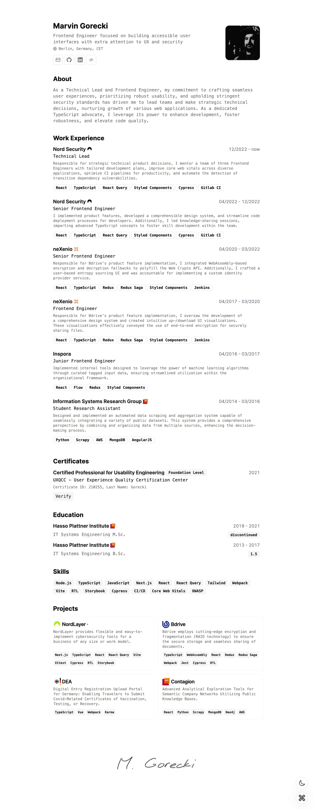

<kbd></kbd>

# Minimalist CV

Simple web app that renders minimalist CV with print-friendly layout.

Built with Next.js and shadcn/ui, deployed on Vercel.

# Features

- Built using Next.js 14, React, Typescript, Shadcn/ui, TailwindCss
- Auto generated Layout
- Responsive for different devices
- Light/Dark mode support
- Print-friendly
- Optimized for Next.js and Vercel

# Getting Started Locally

1. Clone this repository to your local machine:

   ```bash
   git clone https://github.com/slayerpart/cv.git
   ```

2. Move to the cloned directory

   ```bash
   cd cv
   ```

3. Install dependencies:

   ```bash
   yarn install
   ```

4. Start the local Server:

   ```bash
   yarn dev
   ```

5. Open the [Config file](./src/data/resume-data.tsx) and make changes

# Run with Docker

Build the container

```sh
docker compose build
```

Run the container

```sh
docker compose up -d
```

Stop the Container

```sh
docker compose down
```

# License

[MIT](https://choosealicense.com/licenses/mit/)
